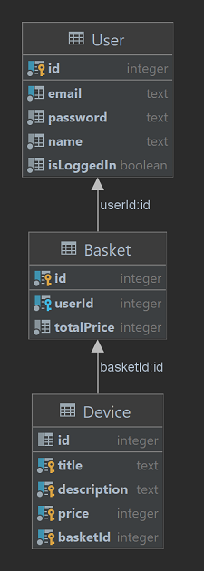

## Description

[Посмотреть результат](https://applemarketru.herokuapp.com/)

Объектом разработки является интернет-магазин на языке программирования TypeScript с использованием фреймворка Nest – для серверной части приложения, с использованием Bootstrap – для клиентской части приложения.

- В качестве веб-сервера используется Express.

- В качестве базы данных используется PostgreSQL.

- В качестве хостинга используется облачный сервис Heroku.
## Database ERD

    

- User – модель, описывающая пользователя, у которого есть имя, адрес электронной почты и пароль.

- Basket – корзина пользователя, в которой находится массив девайсов, общая стоимость корзины и id пользователя, владеющего данной корзиной.

- Device – девайс, товар, информацию о котором может просматривать пользователь, а также добавить к себе в корзину. Девайс имеет имя, описание, цену и id корзины, в которой он находится.
